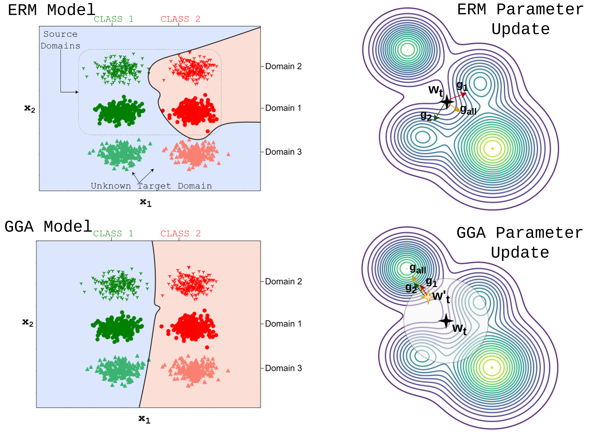
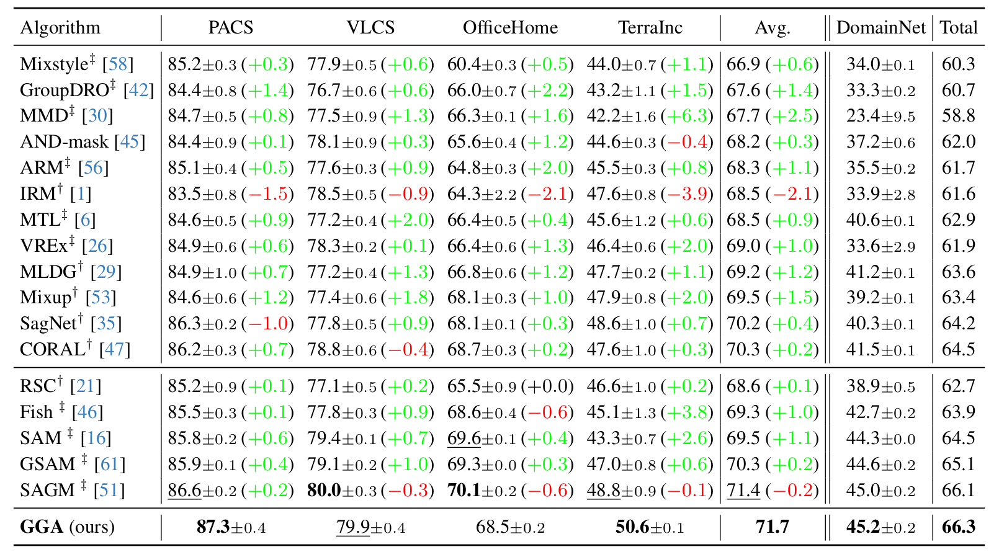
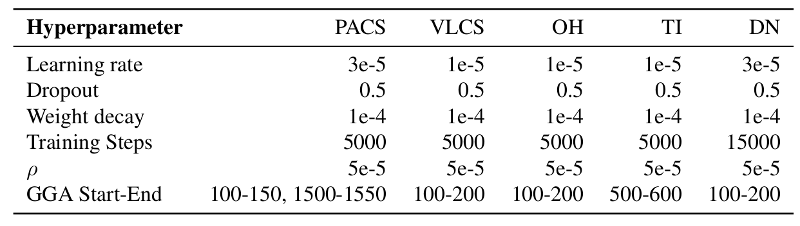

# GGA
The official codes of our CVPR2025 paper: [Gradient-Guided Annealing for Domain Generalization](https://arxiv.org/abs/2502.20162)

In this paper we observe that the initial iterations of model training play a key 
role in domain generalization effectiveness, since the loss landscape may be 
significantly different across the training and test distributions, contrary 
to the case of i.i.d. data. Conflicts between gradients of the loss 
components of each domain lead the optimization procedure to undesirable 
local minima that do not capture the domain-invariant features of the target 
classes. We propose alleviating domain conflicts in model optimization, by 
iteratively annealing the parameters of a model in the early stages of 
training and searching for points where gradients align between domains. By 
discovering a set of parameter values where gradients are updated towards the 
same direction for each data distribution present in the training set, the 
proposed **Gradient-Guided Annealing (GGA)** algorithm encourages models to seek 
out minima that exhibit improved robustness against domain shifts.

<p align="center">
    
</p>

Note that this project is built upon [SWAD](https://github.com/khanrc/swad) and [DomainBed](https://github.com/facebookresearch/DomainBed/).


## Preparation

### Dependencies

```sh
pip install -r requirements.txt
```

### Datasets

```sh
python -m domainbed.scripts.download --data_dir=/my/datasets/path
```

### Environments

Environment details used for our study.

```
Python: 3.10.12
PyTorch: 2.0.1
Torchvision: 0.15.2
CUDA: 11.8
```

## How to Run

`train_all.py` script conducts multiple leave-one-out cross-validations for all target domain.

```sh
python train_all.py exp_name --dataset PACS --data_dir /my/datasets/path --trial_seed <seed> --algorithm <algorithm> --checkpoint_freq 100 --lr 3e-5 --weight_decay 1e-4 --resnet_dropout 0.5 --swad False

```

### Run all experiments

We provide the instructions to reproduce the main results of the paper, Table 1 and 2.
Note that the difference in a detailed environment or uncontrolled randomness may bring a slightly different result from the paper.

- PACS

```
python train_all.py PACS0 --dataset PACS --data_dir /my/datasets/path --deterministic --trial_seed 0 --algorithm ERM_GGA --checkpoint_freq 100 --lr 3e-5 --weight_decay 1e-4 --resnet_dropout 0.5 --swad False --batch_size 48 \
--start_step 100 --end_step 150 --extra_search_start 1500 --extra_search_end 1550
```

- VLCS

```
python train_all.py VLCS0 --dataset VLCS --data_dir /my/datasets/path --deterministic --trial_seed 0 --algorithm ERM_GGA --checkpoint_freq 100 --lr 1e-5 --weight_decay 1e-4 --resnet_dropout 0.5 --swad False --batch_size 48 \
--start_step 100 --end_step 200
```

- OfficeHome

```
python train_all.py OH0 --dataset OfficeHome --data_dir /my/datasets/path --deterministic --trial_seed 0 --algorithm ERM_GGA --checkpoint_freq 100 --lr 1e-5 --weight_decay 1e-4 --resnet_dropout 0.5 --swad False --batch_size 48 \
--start_step 100 --end_step 200
```

- TerraIncognita

```
python train_all.py TR0 --dataset TerraIncognita --data_dir /my/datasets/path --deterministic --trial_seed 0 --algorithm ERM_GGA --checkpoint_freq 100 --lr 1e-5 --weight_decay 1e-4 --resnet_dropout 0.5 --swad False --batch_size 48 \
--start_step 500 --end_step 600
```

- DomainNet

```
python train_all.py DN0 --dataset DomainNet --data_dir /my/datasets/path --deterministic --trial_seed 0 --algorithm ERM_GGA --checkpoint_freq 100 --lr 3e-5 --weight_decay 1e-6 --resnet_dropout 0.5 --swad False \
--start_step 100 --end_step 200
```


## Main Results

<p align="center">
    
</p>

## Our searched HPs

<p align="center">
    
</p>

## Citation

Please cite this paper if it helps your research:

```
@inproceedings{ballas2025gradient,
  title={Gradient-Guided Annealing for Domain Generalization},
  author={Ballas, Aristotelis and Diou, Christos},
  booktitle={Proceedings of the Computer Vision and Pattern Recognition Conference},
  pages={20558--20568},
  year={2025}
}
```


## License

This source code is released under the MIT license, included [here](./LICENSE).

This project includes some code from [DomainBed](https://github.com/facebookresearch/DomainBed/tree/3fe9d7bb4bc14777a42b3a9be8dd887e709ec414), also MIT licensed.

